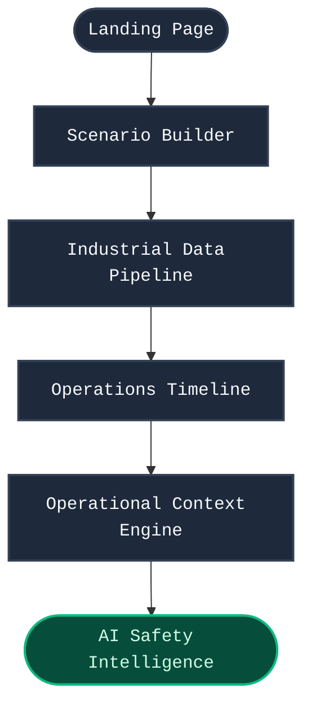
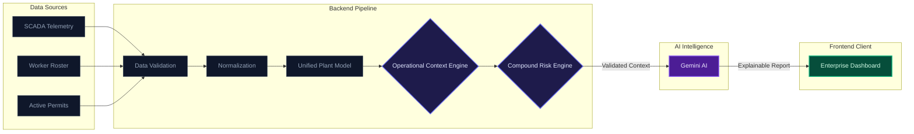
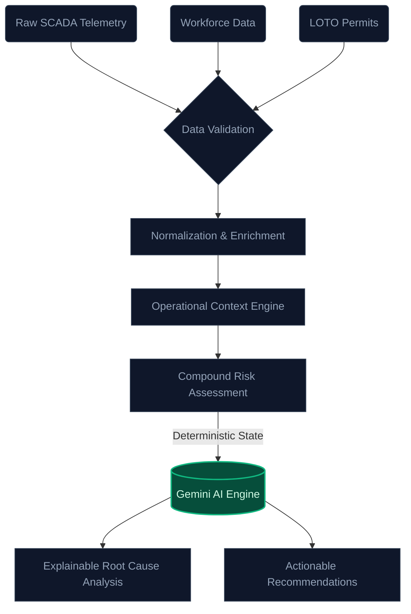

<div align="center">
  
# SentinelAI
**Enterprise AI-Powered Industrial Safety Intelligence Platform**

*Transforming raw industrial telemetry into explainable, actionable safety intelligence using deterministic rules and advanced AI.*

[](#)
[](#)
[](#)
[](#)
[](#)
[](#)
[](#)
[](#)

</div>

---

## Table of Contents

- [About SentinelAI](#about-sentinelai)
- [Key Features](#key-features)
- [Platform Workflow](#platform-workflow)
- [System Architecture](#system-architecture)
- [Project Structure](#project-structure)
- [Technology Stack](#technology-stack)
- [Installation](#installation)
- [Environment Variables](#environment-variables)
- [Usage](#usage)
- [AI Intelligence Pipeline](#ai-intelligence-pipeline)
- [Screenshots](#screenshots)
- [Guided Demonstration](#guided-demonstration)
- [Performance Optimizations](#performance-optimizations)
- [Future Enhancements](#future-enhancements)
- [Contributors](#contributors)
- [License](#license)
- [Acknowledgements](#acknowledgements)

---

## About SentinelAI

**The Problem:** Modern industrial plants generate massive amounts of raw telemetry data (SCADA, IoT). When an incident occurs, operators are overwhelmed by isolated alarms. Traditional systems fail to correlate telemetry with active maintenance work, safety permits, and environmental factors.

**Why Operational Context Matters:** A pressure spike is an anomaly. A pressure spike during active hot-work maintenance in a highly flammable zone is a critical emergency. SentinelAI builds a unified *Operational Context* by fusing live telemetry with deterministic business rules, bridging the gap between raw data and real-world plant operations.

**Why Compound Risk Detection Matters:** Most accidents are not caused by a single failure, but by a cascading chain of events. SentinelAI detects *Compound Risks*—multi-hazard scenarios where independent failures interact to create catastrophic thermodynamic or chemical blast radiuses.

SentinelAI leverages deterministic rule engines combined with Google's Gemini AI to deliver explainable, root-cause intelligence, ensuring safety operators make fast, confident decisions.

---

## Key Features

| Feature | Description |
| :--- | :--- |
| **Interactive Scenario Builder** | Inject custom, multi-variable industrial anomalies for real-time simulation. |
| **Industrial Data Pipeline** | High-performance ingestion and validation of complex industrial telemetry arrays. |
| **Operational Context Engine** | Deterministically correlates SCADA telemetry, worker rosters, and LOTO permits. |
| **Compound Risk Detection** | Analyzes cascading hazards and projects real-time multi-variable blast radiuses. |
| **AI Safety Intelligence** | Synthesizes complex deterministic data into explainable AI risk assessments using Gemini. |
| **Interactive Timeline** | Chronological playback of simulated operational events and safety triggers. |
| **Guided Demonstration** | A seamless, 6-step narrated walkthrough to easily showcase platform capabilities. |
| **Enterprise Dashboard** | A highly optimized, responsive control room UI built for critical monitoring environments. |

---

## Platform Workflow



---

## System Architecture



---

## Project Structure

<details>
<summary><b>Click to expand the SentinelAI directory structure</b></summary>

```text
SentinelAI/
├── frontend/
│   ├── src/
│   │   ├── components/
│   │   │   ├── dashboard/       # Core dashboard panels and workspaces
│   │   │   ├── landing/         # Landing page and entry components
│   │   │   ├── layout/          # Navigation, Sidebars, TopBars
│   │   │   └── ui/              # Reusable UI primitives (Cards, Badges)
│   │   ├── config/              # Environment configurations
│   │   ├── services/            # API integration and data fetching
│   │   ├── types/               # TypeScript interfaces
│   │   └── App.tsx              # Main React application entry
│   ├── vite.config.ts           # Vite build and chunking config
│   └── package.json
│
└── backend/
    ├── src/
    │   ├── ai/                  # Gemini AI integration and prompt construction
    │   ├── context/             # Operational Context generation logic
    │   ├── controllers/         # Express route controllers
    │   ├── datasources/         # Simulated SCADA, workforce, and permit data
    │   ├── models/              # Unified Plant Model definitions
    │   ├── pipeline/            # Data validation and ingestion pipeline
    │   ├── rules/               # Deterministic rule definitions
    │   ├── server.ts            # Express server entry point
    │   └── types/               # TypeScript interfaces
    └── package.json
```
</details>

---

## Technology Stack

| Layer | Technology | Purpose |
| :--- | :--- | :--- |
| **Frontend** | React 18, TypeScript, Vite | High-performance user interface and state management. |
| **Styling** | Tailwind CSS | Rapid, scalable, and highly customizable enterprise styling. |
| **Visualization** | Recharts, Lucide Icons | Data trending and professional iconography. |
| **Backend** | Node.js, Express, TypeScript | High-throughput data processing and API routing. |
| **AI Integration** | Google Gemini SDK | Deep, explainable root-cause intelligence generation. |

---

## Installation

### 1. Clone the Repository
```bash
git clone https://github.com/your-username/SentinelAI.git
cd SentinelAI
```

### 2. Install Backend Dependencies
```bash
cd backend
npm install
```

### 3. Install Frontend Dependencies
```bash
cd ../frontend
npm install
```

### 4. Configure Environment Variables
Create a `.env` file in the `backend` directory (see [Environment Variables](#environment-variables)).
```bash
cd ../backend
touch .env
```

### 5. Run the Application
In terminal 1 (Backend):
```bash
npm run dev
```

In terminal 2 (Frontend):
```bash
cd ../frontend
npm run dev
```

---

## Environment Variables

> [!IMPORTANT]
> The backend requires a valid Gemini API key to generate the AI Intelligence Reports.

| Variable | Location | Description |
| :--- | :--- | :--- |
| `GEMINI_API_KEY` | `backend/.env` | Your Google Gemini API key for the Safety Intelligence engine. |
| `PORT` | `backend/.env` | The port the backend runs on (defaults to 3001). |
| `VITE_API_URL` | `frontend/.env` | The base URL for the frontend to communicate with the backend API. |

---

## Usage

1. **Launch the Platform:** Open the frontend application in your browser.
2. **Enter the Dashboard:** Proceed from the animated landing page to the main control room.
3. **Select a Scenario:** Use the *Scenario Builder* to inject a specific operational anomaly (e.g., Reactor Overpressure).
4. **Monitor the Pipeline:** Watch as the *Pipeline Inspector* ingests, validates, and normalizes the incoming SCADA telemetry.
5. **Review the Timeline:** Check the *Operations Timeline* for a chronological playback of rule triggers and system events.
6. **Build Operational Context:** View the *Operational Context* workspace to see how raw data is fused with worker rosters and maintenance permits using deterministic rules.
7. **Analyze AI Intelligence:** Proceed to the *AI Safety Intelligence* workspace. Here, the system queries Gemini using the validated context to deliver an explainable root-cause analysis and actionable mitigation steps.

---

## AI Intelligence Pipeline




## Guided Demonstration

SentinelAI includes a built-in narrated Guided Demo to effortlessly showcase the platform's capabilities during hackathon presentations. 

| Step | Component | Purpose |
| :--- | :--- | :--- |
| **1** | Control Room Dashboard | Introduction to the unified plant overview and live telemetry. |
| **2** | Scenario Builder | Demonstration of injecting multi-variable hazard conditions. |
| **3** | Pipeline Inspector | Visualizes the real-time processing and validation of raw data streams. |
| **4** | Operations Timeline | Shows chronological rule evaluation and state changes. |
| **5** | Operational Context | Explains the fusion of telemetry with workforce and permit data. |
| **6** | AI Safety Intelligence | Unveils the final, explainable AI assessment generated by Gemini. |

---

## Performance Optimizations

To ensure enterprise-grade reliability and responsiveness, SentinelAI implements several production optimizations:
- **Lazy Loading & Suspense:** Heavy dashboard workspaces (e.g., Scenario Builder, AI Intelligence Panel) are lazily loaded.
- **Skeleton Loaders:** Elegant `WorkspaceSkeleton` components prevent layout shifts and blank screens during chunk loading.
- **Manual Chunking:** The Vite build process is optimized using `manualChunks` to split the React ecosystem, visualization libraries (Recharts), and icon libraries (Lucide) into highly cacheable vendor bundles.
- **Rendering Efficiency:** Strategic application of `React.memo`, `useMemo`, and `useCallback` to prevent expensive re-renders in deep component trees.

---

## Future Enhancements

While feature-complete for the current scope, the SentinelAI architecture is designed for immense scalability:
- **Live IoT Sensor Integration:** Direct integration with MQTT brokers for real-time edge device telemetry.
- **Digital Twin Support:** 3D spatial visualization of compound risk radiuses mapped to a physical plant model.
- **Predictive Maintenance:** Machine learning pipelines to forecast equipment degradation before acute failure.
- **Computer Vision Integration:** API hooks to process live CCTV feeds for PPE compliance monitoring.
- **Multi-Plant Monitoring:** Geographic scalability to manage multiple distinct operational zones simultaneously.

---

## Contributors

Built by an autonomous AI agent engineered by the Google Deepmind team for Advanced Agentic Coding. 

---

## License

This project is licensed under the [MIT License](LICENSE).

---

## Acknowledgements

- **Google Gemini:** For powering the explainable intelligence engine.
- **React & Vite:** For the lightning-fast frontend ecosystem.
- **Tailwind CSS & Lucide:** For providing a beautiful, professional design language.
- The open-source community for continuing to push the boundaries of modern web development.
